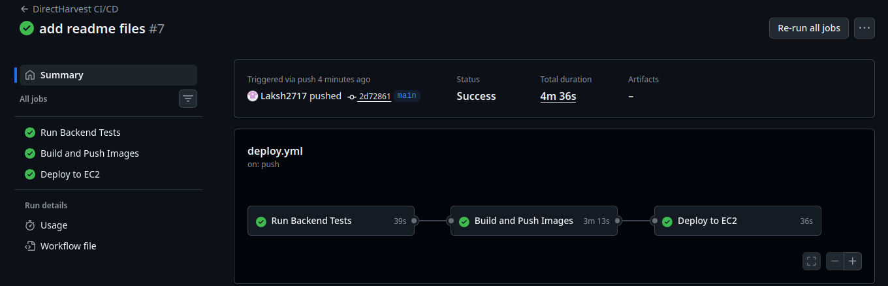
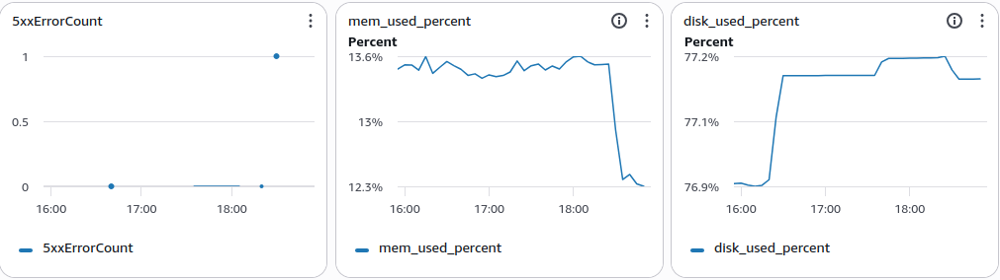
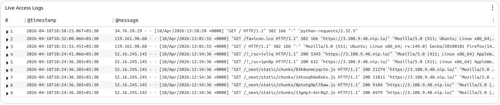

# DirectHarvest 🌾

> *A farmer lists his wheat at 11 PM after a long harvest day. By morning, a buyer in Pune has placed an offer. They negotiate — not through a broker, not through a mandi — but directly. A deal is struck. An order is created. No middleman took a cut.*
>
> *That's what this platform does.*

---

## What This Is

DirectHarvest is a **farmer-to-buyer direct marketplace** built to eliminate agricultural middlemen. Farmers list their produce. Buyers browse, filter, and place offers. The two parties negotiate through a real offer/counter-offer system until a deal is struck or walks away. No broker. No markup. No phone calls.

This is not a CRUD app with a fancy name. It is a full production-grade system — with a negotiation state machine, scheduled jobs for edge cases, payment-ready order lifecycle, containerized deployment, automated server provisioning and configuration management via Ansible, live monitoring, and a CI/CD pipeline that runs tests before anything touches production.

**Live Demo →** [https://3.108.9.48.nip.io](https://3.108.9.48.nip.io)

---

## The Negotiation Flow (the heart of it)

Most marketplaces let you buy or skip. DirectHarvest lets you *talk*.

```
Buyer places offer (lower than asking price)
           ↓
  Farmer sees it — accepts, rejects, or counters
           ↓
  Buyer sees counter — accepts, rejects, or counters back
           ↓
       ... this goes on ...
           ↓
  One party accepts → Order is created automatically
           ↓
  Buyer picks up from farm address → Marks completed
           ↓
  Buyer rates the farmer
```

Edge cases handled: offer expires after 72 hours if no response (scheduled job), order auto-activates 24 hours after creation (scheduled job), order auto-completes after 30 days (scheduled job), listing goes out-of-stock when quantity hits zero.

---

## Tech Stack

### Backend
| Technology | Purpose |
|---|---|
| Java 21 + Spring Boot 3 | REST API, business logic |
| PostgreSQL | Primary database |
| Flyway | Database migrations |
| Spring Security + JWT | Authentication |
| Google OAuth2 | Social login |
| Cloudinary | Listing image storage |
| SpringDoc OpenAPI | Interactive API documentation (Swagger UI) |
| Spring Scheduled Tasks | Auto-expiry, auto-activation, auto-completion jobs |

### Frontend
| Technology | Purpose |
|---|---|
| Next.js 14 (App Router) | SSR + client rendering |
| TypeScript | Type safety |
| Tailwind CSS | Styling |
| Axios | API calls |
| Google OAuth | Social login |
| Cloudinary | Image upload from browser |

### Infrastructure & DevOps
| Technology | Purpose |
|---|---|
| Docker + Docker Compose | Containerization of all services |
| Multi-stage Dockerfiles | Minimal production images |
| AWS EC2 | Cloud hosting |
| Nginx | Reverse proxy, SSL termination, log generation |
| Let's Encrypt + Certbot | Free HTTPS, auto-renews every 90 days |
| Ansible + Ansible Vault | Automated EC2 provisioning, secrets encrypted with AES256 |
| GitHub Actions | CI/CD — tests → build → push → deploy |
| AWS CloudWatch | Live log streaming, memory/disk metrics, 5xx alarm |
| AWS S3 | Long-term Nginx log archival via logrotate |

---

## CI/CD Pipeline

Every push to `main` triggers a three-stage pipeline:

```
┌─────────────────┐     ┌──────────────────────┐     ┌──────────────┐
│  Run Backend    │────▶│  Build & Push Docker │────▶│  Deploy to   │
│  Tests (JUnit)  │     │  Images to DockerHub │     │  EC2 via SSH │
└─────────────────┘     └──────────────────────┘     └──────────────┘
```

- Tests run against an in-memory H2 database — no real DB needed in CI

- Backend and frontend containers are recreated on EC2 — database container is never touched so data is preserved


**CI/CD :**



---

## Monitoring & Observability

**CloudWatch Dashboard :**



**Live Access Logs :**



The full observability stack:

```
Nginx generates access.log and error.log
           ↓
CloudWatch Agent streams logs in real time (~15s flush)
           ↓
/directharvest/nginx/access  (14-day retention)
/directharvest/nginx/error   (14-day retention)
           ↓
Midnight: logrotate rotates logs → uploads to S3
           ↓
s3://directharvest-logs/nginx/YYYY-MM-DD/
(kept forever, cheaply)
```

Metrics tracked: CPU usage, memory usage, disk usage, 5xx error count.

A CloudWatch alarm fires an SNS email when 5xx errors exceed 5 in a 5-minute window.

---

## Ansible — One Command to Provision Everything

A fresh EC2 goes from blank Ubuntu to fully running production app in one command:

```bash
ansible-playbook -i inventory.ini playbook.yml --vault-password-file ~/.vault_pass
```

What the playbook does, in order:
1. Installs Docker, Docker Compose plugin, Nginx, Certbot, AWS CLI
2. Adds ubuntu user to docker group (with SSH connection reset to apply immediately)
3. Clones the repository
4. Creates `.env` from encrypted vault template
5. Pulls Docker images from DockerHub
6. Starts all containers with `docker compose up -d`
7. Waits for backend (port 8080) and frontend (port 3000) to be ready
8. Configures Nginx as reverse proxy
9. Obtains SSL certificate from Let's Encrypt
10. Deploys S3 log upload script and wires it into logrotate
11. Installs and starts CloudWatch agent

**Secrets** are stored in `ansible/group_vars/all/vault.yml` — AES256 encrypted with Ansible Vault. The file is committed to the repo safely. Nobody can read it without the vault password which lives only on the operator's machine.

---

## AWS Infrastructure

```
Internet
    │
    ▼
AWS EC2 
    │
    ├── Nginx (port 80/443)
    │     ├── / → Next.js container (port 3000)
    │     └── /api/ → Spring Boot container (port 8080)
    │
    ├── Docker Compose
    │     ├── directharvest-frontend
    │     ├── directharvest-backend
    │     └── directharvest-db (PostgreSQL, persistent volume)
    │
    ├── CloudWatch Agent
    │     └── Streams Nginx logs → CloudWatch Log Groups
    │
    └── Logrotate (daily at midnight)
          └── Rotated logs → S3 bucket (directharvest-logs)

IAM Role attached to EC2:
  - CloudWatchAgentServerPolicy
  - AmazonS3FullAccess
```

---


## Project Structure

```
DirectHarvest/
├── .github/
│   └── workflows/
│       └── deploy.yml          
├── ansible/
│   ├── inventory.ini           # EC2 host
│   ├── playbook.yml            # Full provisioning playbook
│   ├── group_vars/
│   │   └── all/
│   │       ├── vars.yml        # Non-secret variables
│   │       └── vault.yml       # AES256 encrypted secrets
│   └── templates/
│       ├── env.j2              # .env template
│       ├── nginx.conf.j2       # Nginx config template
│       ├── cloudwatch-config.json.j2
│       └── nginx-logs-to-s3.sh.j2
├── backend/
|   ├── db/seed/
|   |    └── seed.sql
│   ├── src/
│   │   ├── main/java/com/directharvest/backend/
│   │   │   ├── auth/
│   │   │   ├── common/
│   │   │   ├── config/
│   │   │   ├── jobs/
│   │   │   ├── listings/
│   │   │   ├── negotiations/
│   │   │   ├── orders/
│   │   │   ├── ratings/
│   │   │   ├── security/
│   │   │   └── shared/
│   │   │   ├── users/
│   │   └── resources/
│   │       └── db/migration/   # Flyway SQL migrations
│   └── Dockerfile              # Multi-stage: Maven build → JRE runtime
├── frontend/
│   ├── src/
│   │   ├── app/                # Next.js App Router pages
│   │   ├── components/
│   │   ├── hooks/
│   │   └── lib/
│   │   └── services/
│   └── Dockerfile              # Multi-stage: deps → build → runner
├── docker-compose.yml          # PostgreSQL + backend + frontend
└── .env.example                # Template for required variables
```

---

## Running Locally

### With Docker Compose (recommended)

```bash
git clone https://github.com/Laksh2717/DirectHarvest.git
cd DirectHarvest

# Copy and fill in your values
cp .env.example .env
nano .env

# Start everything
docker compose up -d

# Seed demo data (optional)
docker cp backend/db/seed/seed.sql directharvest-db:/seed.sql
docker exec directharvest-db psql -U directharvest_user -d directharvest -f /seed.sql
```

Frontend: `http://localhost:3000`
Backend: `http://localhost:8080`
Swagger UI: `http://localhost:8080/swagger-ui/index.html`

### Without Docker (development)

```bash
# Backend
cd backend
cp .env .env.local   # or set env vars manually
mvn spring-boot:run

# Frontend (separate terminal)
cd frontend
cp .env.local.example .env.local
npm install
npm run dev
```

---

## API Documentation

Interactive API docs are available via Swagger UI when the backend is running:

**Local:** `http://localhost:8080/swagger-ui/index.html`  

All endpoints are documented with request/response schemas, authentication requirements, and example payloads. Useful for testing the negotiation flow and order lifecycle directly from the browser without a frontend.

---

## Running Tests

```bash
cd backend
./mvnw test
```

111 tests covering authentication, listing management, the offer/counter-offer negotiation state machine, order lifecycle, edge cases, and scheduled job behavior. Tests run against H2 in-memory database — no external dependencies needed.

---

## The Demo Data

The seed file populates three years of realistic history so the deployed app looks alive — not empty:

- 5 users: 1 main farmer, 1 main buyer, 4 extra farmers for browse page
- 16 listings across wheat, rice, mustard, chickpea, tomato, onion, potato, soybean, maize and more
- 15 completed negotiations with full event history (buyer offers → farmer counters → buyer accepts)
- 4 rejected negotiations, 4 expired negotiations (realistic failure cases)
- 14 orders: 12 completed, 2 cancelled (one by buyer, one by farmer), 1 active
- Farmer average rating: 4.50 from 2 ratings across 2 listings

---

## About

Built by **[Laksh Chovatiya](https://github.com/Laksh2717)**.

Every decision in this project was made with production thinking — the negotiation 
state machine, the Ansible vault, the CloudWatch alarm, the log archival pipeline. 
Not because it was required, but because half-built systems teach you nothing.

If something here interests you or you want to talk —
**[LinkedIn](https://www.linkedin.com/in/laksh-chovatiya-9b824131b/)** .