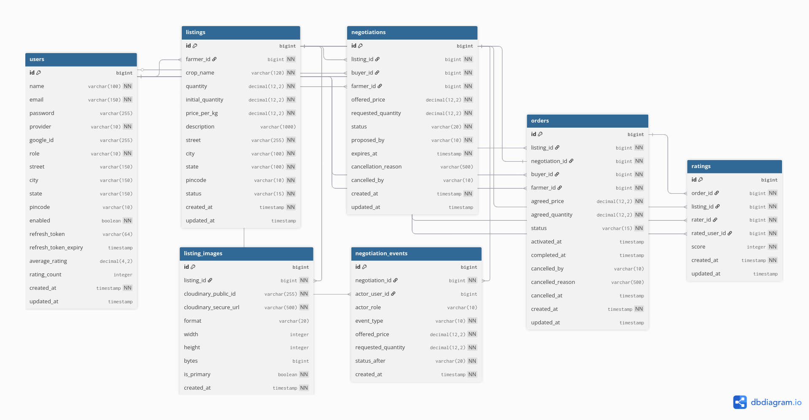

# DirectHarvest — Backend

A production-grade REST API built with **Java 21** and **Spring Boot 3**, powering a direct farmer-to-buyer agricultural marketplace. The backend is responsible for the negotiation state machine, order lifecycle automation, image management, and all business logic that makes the platform work.

---

## Tech Stack

| Technology | Purpose | Version |
|---|---|---|
| **Java** | Core language | 21 |
| **Spring Boot** | REST API framework | 3.x |
| **Spring Security** | JWT authentication, route protection | 3.x |
| **Spring Data JPA** | ORM and database abstraction | 3.x |
| **Spring Scheduled Tasks** | Background jobs — offer expiry, order activation, auto-completion | 3.x |
| **PostgreSQL** | Primary relational database | 16 |
| **Flyway** | Database versioning and automated migrations | Latest |
| **JWT (jjwt)** | Token generation and validation | 0.12.3 |
| **SpringDoc OpenAPI** | Interactive API docs via Swagger UI | 2.x |
| **Cloudinary** | Listing image storage and deletion | Latest |
| **H2 Database** | In-memory database for testing | Latest |
| **Lombok** | Boilerplate reduction | Latest |
| **Jakarta Validation** | Request constraint checking | 3.x |

---

## Project Structure

```
backend/
├── src/
│   ├── main/
│   │   ├── java/com/directharvest/backend/
│   │   │   ├── BackendApplication.java
│   │   │   │
│   │   │   ├── config/
│   │   │   │   └── OpenApiConfig.java               
│   │   │   │
│   │   │   ├── auth/                                
│   │   │   │   ├── controller/
│   │   │   │   ├── service/
│   │   │   │   ├── request/
│   │   │   │   └── response/
│   │   │   │
│   │   │   ├── users/                               
│   │   │   │   ├── controller/
│   │   │   │   ├── entity/
│   │   │   │   ├── service/
│   │   │   │   ├── repository/
│   │   │   │   ├── request/
│   │   │   │   └── response/
│   │   │   │
│   │   │   ├── listings/                            
│   │   │   │   ├── controller/
│   │   │   │   ├── entity/                          
│   │   │   │   ├── event/                           
│   │   │   │   ├── service/
│   │   │   │   ├── repository/
│   │   │   │   ├── request/                         
│   │   │   │   └── response/                        
│   │   │   │
│   │   │   ├── negotiations/                        
│   │   │   │   ├── controller/
│   │   │   │   ├── entity/                          
│   │   │   │   ├── service/
│   │   │   │   ├── repository/
│   │   │   │   ├── request/                         
│   │   │   │   └── response/                        
│   │   │   │
│   │   │   ├── orders/                              
│   │   │   │   ├── controller/
│   │   │   │   ├── entity/                          
│   │   │   │   ├── service/
│   │   │   │   ├── repository/
│   │   │   │   ├── request/                         
│   │   │   │   └── response/                        
│   │   │   │
│   │   │   ├── ratings/                             
│   │   │   │   ├── controller/
│   │   │   │   ├── entity/
│   │   │   │   ├── service/
│   │   │   │   ├── repository/
│   │   │   │   ├── request/
│   │   │   │   └── response/
│   │   │   │
│   │   │   ├── dashboard/                           
│   │   │   │   ├── controller/
│   │   │   │   ├── service/
│   │   │   │   ├── request/
│   │   │   │   └── response/
│   │   │   │
│   │   │   ├── jobs/                                
│   │   │   │   ├── NegotiationExpiryJob.java        
│   │   │   │   ├── OrderActivationJob.java          
│   │   │   │   ├── OrderAutoCompleteJob.java        
│   │   │   │   └── CloudinaryDeleteRetryJob.java    
│   │   │   │
│   │   │   ├── security/                            
│   │   │   │   ├── config/                          
│   │   │   │   ├── jwt/                             
│   │   │   │   ├── filter/                          
│   │   │   │   └── service/                         
│   │   │   │
│   │   │   ├── shared/
│   │   │   │   └── cloudinary/                      
│   │   │   │       ├── controller/
│   │   │   │       ├── service/
│   │   │   │       ├── request/
│   │   │   │       └── response/
│   │   │   │
│   │   │   └── common/                              
│   │   │       ├── enums/                           
│   │   │       │                                    
│   │   │       ├── exception/                       
│   │   │       │                                    
│   │   │       ├── response/                        
│   │   │       └── validation/                      
│   │   │
│   │   └── resources/
│   │       ├── application.yml                      
│   │       └── db/migration/                        
│   │
│   └── test/
│       └── java/com/directharvest/backend/
│           ├── auth/                                
│           ├── users/                               
│           ├── listings/                            
│           ├── negotiations/                        
│           ├── orders/                              
│           ├── jobs/                                
│           └── ratings/                             
│
├── pom.xml
└── Dockerfile                                       
```

---

## The Negotiation State Machine

This is the core of the platform. Every offer goes through a strict state machine — no transitions are allowed outside the defined flow.

```
Buyer creates offer
        ↓
  PENDING_FARMER  ←─────────────────────────────────┐
        │                                            │
   Farmer responds                                   │
        │                                            │
  ┌─────┴──────┐                                     │
  │            │                                     │
ACCEPT      COUNTER ──→ PENDING_BUYER                │
  │                          │                       │
  │                    Buyer responds                │
  │                          │                       │
  ↓                    ┌─────┴──────┐                │
ACCEPTED            ACCEPT       COUNTER ────────────┘
  │                  │
  ↓                  ↓
Order             ACCEPTED
created             │
automatically       ↓
                  Order
                 created

At any point:
  REJECTED → terminal
  EXPIRED  → terminal (system job after 72 hours)
```

**Key rules enforced in code:**
- Only the non-proposing party can respond — turn-based strictly enforced
- Expiry window resets to 72 hours on every counter-offer
- Once ACCEPTED, order is created atomically in the same transaction
- Listing quantity reduces only on acceptance — not on offer creation
- Each state change is recorded in `negotiation_events` as an immutable audit trail

---

## Order Lifecycle

```
CONFIRMED  (0–24 hours after creation)
    │
    │  [OrderActivationJob — runs every hour]
    ↓
  ACTIVE  
    │
    │  [OrderAutoCompleteJob — runs every 24 hours]
    ↓
COMPLETED

OR from CONFIRMED only (within 24-hour window):
    ↓
CANCELLED  (buyer or farmer initiated)
  → listing quantity restored automatically
```

---

## Scheduled Background Jobs

| Job | Trigger | Window | Action |
|---|---|---|---|
| `NegotiationExpiryJob` | Every hour | `expires_at ≤ NOW` | Sets status to EXPIRED, creates EXPIRED event with null actor |
| `OrderActivationJob` | Every hour | `created_at ≤ NOW - 24h` | Sets status to ACTIVE, records `activated_at` |
| `OrderAutoCompleteJob` | Every 24 hours | `created_at ≤ NOW - 30d` | Sets status to COMPLETED, records `completed_at` |
| `CloudinaryDeleteRetryJob` | Configurable | Exponential backoff | Retries failed Cloudinary image deletions via outbox pattern |

All jobs process in configurable batches (default: 50) to prevent memory issues under load.

---

## API Endpoints

### Authentication
```
POST  /auth/register/farmer     Register as farmer
POST  /auth/register/buyer      Register as buyer
POST  /auth/login               Email/password login → JWT tokens
POST  /auth/refresh             Refresh access token using refresh token
POST  /auth/logout              Invalidate refresh token
POST  /auth/google              Google OAuth login/register
GET   /auth/me                  Get current authenticated user
```

### Listings
```
GET   /listings                 Browse listings — paginated (12/page), sortable, searchable by crop name [PUBLIC]
GET   /listings/{id}            Get listing details with images [PUBLIC]
POST  /listings                 Create listing with images [FARMER]
PUT   /listings/{id}            Update listing details [FARMER, no active negotiations]
PUT   /listings/{id}/price      Update price only [FARMER, no active negotiations]
PUT   /listings/{id}/quantity   Add quantity to listing [FARMER]
POST  /listings/{id}/images     Add images to listing (max 5 total) [FARMER]
DELETE /listings/{id}/images/{imageId}  Remove image [FARMER]
PUT   /listings/{id}/status     Activate or deactivate listing [FARMER]
GET   /listings/my              Get own listings with optional status filter [FARMER]
```

### Negotiations
```
POST  /negotiations             Create offer on a listing [BUYER]
GET   /negotiations             Get own negotiations with optional status filter
GET   /negotiations/{id}        Get negotiation details
GET   /negotiations/{id}/events Get full event history (audit trail)
POST  /negotiations/{id}/counter  Submit counter-offer [turn-based]
POST  /negotiations/{id}/accept   Accept current offer [turn-based]
POST  /negotiations/{id}/reject   Reject current offer with optional reason [turn-based]
```

### Orders
```
GET   /orders                   Get own orders with optional status filter
GET   /orders/{id}              Get order details with negotiation history
POST  /orders/{id}/complete     Mark order as completed [BUYER]
POST  /orders/{id}/cancel       Cancel order within 24-hour window [BUYER or FARMER]
```

### Ratings
```
POST  /ratings                  Rate farmer after completed order [BUYER]
```

---

## Database Design



### users
| Column | Type | Constraints |
|---|---|---|
| id | BIGINT | PK, AUTO INCREMENT |
| name | VARCHAR(100) | NOT NULL |
| email | VARCHAR(150) | NOT NULL, UNIQUE |
| password | VARCHAR(255) | nullable (null for Google users) |
| provider | ENUM | NOT NULL — `LOCAL \| GOOGLE` |
| google_id | VARCHAR(255) | UNIQUE, nullable |
| role | ENUM | NOT NULL — `FARMER \| BUYER \| ADMIN` |
| street | VARCHAR(150) | nullable |
| city | VARCHAR(150) | nullable |
| state | VARCHAR(150) | nullable |
| pincode | VARCHAR(10) | nullable |
| enabled | BOOLEAN | NOT NULL, DEFAULT true |
| refresh_token | VARCHAR(64) | nullable |
| refresh_token_expiry | TIMESTAMP | nullable |
| average_rating | DECIMAL(4,2) | nullable (farmers only) |
| rating_count | INTEGER | DEFAULT 0 |
| created_at | TIMESTAMP | NOT NULL, immutable |
| updated_at | TIMESTAMP | nullable |

### listings
| Column | Type | Constraints |
|---|---|---|
| id | BIGINT | PK, AUTO INCREMENT |
| farmer_id | BIGINT | NOT NULL, FK → users.id |
| crop_name | VARCHAR(120) | NOT NULL |
| quantity | DECIMAL(12,2) | NOT NULL — decreases as orders are placed |
| initial_quantity | DECIMAL(12,2) | NOT NULL — original amount, never changes |
| price_per_kg | DECIMAL(12,2) | NOT NULL |
| description | VARCHAR(1000) | nullable |
| street | VARCHAR(255) | NOT NULL |
| city | VARCHAR(100) | NOT NULL |
| state | VARCHAR(100) | NOT NULL |
| pincode | VARCHAR(10) | NOT NULL |
| status | ENUM | NOT NULL — `ACTIVE \| INACTIVE \| OUT_OF_STOCK` |
| created_at | TIMESTAMP | NOT NULL, immutable |
| updated_at | TIMESTAMP | nullable |

### listing_images
| Column | Type | Constraints |
|---|---|---|
| id | BIGINT | PK, AUTO INCREMENT |
| listing_id | BIGINT | NOT NULL, FK → listings.id (CASCADE DELETE) |
| cloudinary_public_id | VARCHAR(255) | NOT NULL |
| cloudinary_secure_url | VARCHAR(500) | NOT NULL |
| format | VARCHAR(20) | nullable |
| width | INTEGER | nullable |
| height | INTEGER | nullable |
| bytes | BIGINT | nullable |
| is_primary | BOOLEAN | NOT NULL |
| created_at | TIMESTAMP | NOT NULL, immutable |

### negotiations
| Column | Type | Constraints |
|---|---|---|
| id | BIGINT | PK, AUTO INCREMENT |
| listing_id | BIGINT | NOT NULL, FK → listings.id |
| buyer_id | BIGINT | NOT NULL, FK → users.id |
| farmer_id | BIGINT | NOT NULL, FK → users.id |
| offered_price | DECIMAL(12,2) | NOT NULL — current proposed price |
| requested_quantity | DECIMAL(12,2) | NOT NULL — current proposed quantity |
| status | ENUM | NOT NULL — `PENDING_FARMER \| PENDING_BUYER \| ACCEPTED \| REJECTED \| EXPIRED` |
| proposed_by | ENUM | NOT NULL — `BUYER \| FARMER` |
| expires_at | TIMESTAMP | NOT NULL — resets on every counter-offer |
| cancellation_reason | VARCHAR(500) | nullable |
| cancelled_by | ENUM | nullable — `BUYER \| FARMER` |
| created_at | TIMESTAMP | NOT NULL, immutable |
| updated_at | TIMESTAMP | nullable |

### negotiation_events
| Column | Type | Constraints |
|---|---|---|
| id | BIGINT | PK, AUTO INCREMENT |
| negotiation_id | BIGINT | NOT NULL, FK → negotiations.id (CASCADE DELETE) |
| actor_user_id | BIGINT | nullable, FK → users.id — null for system events |
| actor_role | ENUM | nullable — `FARMER \| BUYER \| ADMIN` |
| event_type | ENUM | NOT NULL — `CREATED \| COUNTERED \| ACCEPTED \| REJECTED \| EXPIRED` |
| offered_price | DECIMAL(12,2) | NOT NULL — price snapshot at this event |
| requested_quantity | DECIMAL(12,2) | NOT NULL — quantity snapshot at this event |
| status_after | ENUM | NOT NULL — negotiation status after this event |
| created_at | TIMESTAMP | NOT NULL, immutable |

### orders
| Column | Type | Constraints |
|---|---|---|
| id | BIGINT | PK, AUTO INCREMENT |
| listing_id | BIGINT | NOT NULL, FK → listings.id |
| negotiation_id | BIGINT | NOT NULL, FK → negotiations.id, UNIQUE |
| buyer_id | BIGINT | NOT NULL, FK → users.id |
| farmer_id | BIGINT | NOT NULL, FK → users.id |
| agreed_price | DECIMAL(12,2) | NOT NULL — final negotiated price |
| agreed_quantity | DECIMAL(12,2) | NOT NULL — final negotiated quantity |
| status | ENUM | NOT NULL — `CONFIRMED \| ACTIVE \| COMPLETED \| CANCELLED` |
| activated_at | TIMESTAMP | nullable — set by OrderActivationJob |
| completed_at | TIMESTAMP | nullable — set manually or by OrderAutoCompleteJob |
| cancelled_by | ENUM | nullable — `BUYER \| FARMER \| SYSTEM` |
| cancelled_reason | VARCHAR(500) | nullable |
| cancelled_at | TIMESTAMP | nullable |
| created_at | TIMESTAMP | NOT NULL, immutable |
| updated_at | TIMESTAMP | nullable |

### ratings
| Column | Type | Constraints |
|---|---|---|
| id | BIGINT | PK, AUTO INCREMENT |
| order_id | BIGINT | NOT NULL, FK → orders.id |
| listing_id | BIGINT | NOT NULL, FK → listings.id |
| rater_id | BIGINT | NOT NULL, FK → users.id |
| rated_user_id | BIGINT | NOT NULL, FK → users.id |
| score | INTEGER | NOT NULL — 1 to 5 |
| created_at | TIMESTAMP | NOT NULL, immutable |
| updated_at | TIMESTAMP | nullable |


---

## Local Development

### Prerequisites
- Java 21
- Maven 3.8+
- Docker (for running PostgreSQL locally)

### Setup

**Step 1 — Start PostgreSQL**
```bash
# From root DirectHarvest/ folder
docker compose up -d db
```

**Step 2 — Configure environment**
```bash
cd backend
cp .env.example .env
nano .env    # fill in your values
```

**Step 3 — Run the backend**
```bash
mvn spring-boot:run
```

Backend runs at `http://localhost:8080`  
Swagger UI at `http://localhost:8080/swagger-ui/index.html`

---

## Environment Variables

| Variable | Description | Example |
|---|---|---|
| `DB_NAME` | PostgreSQL database name | `directharvest` |
| `DB_USERNAME` | PostgreSQL username | `directharvest_user` |
| `DB_PASSWORD` | PostgreSQL password | `your_password` |
| `DB_URL` | Full JDBC URL | `jdbc:postgresql://localhost:5432/directharvest` |
| `JWT_ISSUER` | JWT issuer claim | `directharvest` |
| `JWT_SECRET` | JWT signing secret (256-bit minimum) | `your_secret` |
| `JWT_ACCESS_TOKEN_EXPIRATION_MS` | Access token lifetime | `86400000` |
| `JWT_REFRESH_TOKEN_EXPIRATION_MS` | Refresh token lifetime | `2592000000` |
| `GOOGLE_CLIENT_ID` | Google OAuth client ID | `your_client_id` |
| `CLOUDINARY_CLOUD_NAME` | Cloudinary cloud name | `your_cloud` |
| `CLOUDINARY_API_KEY` | Cloudinary API key | `your_key` |
| `CLOUDINARY_API_SECRET` | Cloudinary API secret | `your_secret` |
| `JPA_DDL_AUTO` | Hibernate DDL mode | `validate` |
| `FLYWAY_ENABLED` | Enable Flyway migrations | `true` |

---

## Testing

```bash
cd backend
mvn test
```

**111 tests** covering authentication, listing management, the negotiation state machine (all valid and invalid transitions), order lifecycle, scheduled job behavior, and edge cases. Tests run against H2 in-memory database — no external dependencies needed.

```bash
# Run specific module tests
mvn test -Dtest="NegotiationServiceTest"

# Run with coverage report
mvn clean verify
```

Test configuration uses `application-test.yml` with H2 in-memory database, so tests are fully isolated and reproducible in any environment including CI.

---

## Deployment

The backend is containerized using a **multi-stage Dockerfile**:

```
Stage 1 (build): maven:3.9.6-eclipse-temurin-21
  → mvn dependency:go-offline (cached layer)
  → mvn clean package -DskipTests

Stage 2 (runtime): eclipse-temurin:21-jre-alpine
  → copies only the JAR
  → ~200MB final image vs ~600MB single-stage
```

In production, the container runs behind Nginx which strips the `/api/` prefix before forwarding to Spring Boot on port 8080.

See the root [README](../README.md) for full deployment instructions via Docker Compose and Ansible.

---

## Related

- Frontend: [frontend/README.md](../frontend/README.md)
- Full deployment guide: [Root README](../README.md)
- API contracts: Swagger UI at `http://localhost:8080/swagger-ui.html`